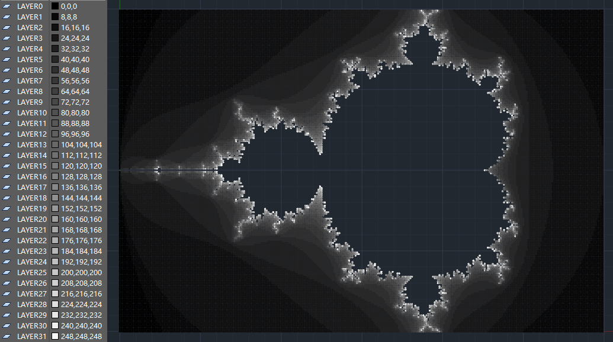

```
 ____    __    ____   __   ____   
(_(__   / /\  / /    / /\  | | \  Simple AutoCAD for Python
___)_) /_/--\ \_\__ /_/--\ |_|_/   by nadesico19@gmail.com
```

# Motivation

So far there are several ways for AutoCAD users to automate their tasks
programmatically. We can choose a programming language among C++/C#/VB/AutoLisp,
and the environment or SDK are well-supported by Autodesk.

When it comes to python, things get complicated. Even though we can write python
code to access AutoCAD ActiveX Automation Interface with the help of pythoncom,
just like what we did in VBA. The annoying RPC_E_CALL_REJECTED error, and the
IPC under every operation, may stall our work process. This prompted me to
launch the project.

# Idea

The core technical idea is to implement the performance sensitive part with
ObjectARX, while using ActiveX only for messaging between python and AutoCAD.

On this basis, we need some well-designed schema, to bundle up as many small
operations as possible in the python world, and transfer them to the AutoCAD to
be carried out by the ObjectARX.

This will give us the ability to use easier to code language to implement what
we need, while achieving much better performance compared to use pythoncom
solely.

# Goal

Sacad is aimed to be a user-friendly toolbox, which helps us implement our own
features that fit our own needs in a comfortable way, and finally simplify our
work life with AutoCAD.

I will try my best to bring as many features as I can, based on ObjectARX's
Managed Wrapper Classes, into this library.

# Example

```python
import itertools
import sacad as ac

with ac.instant_acad() as cad:
    width, height, depth = 300, 200, 32
    trans = cad.db_insert()

    trans.layer_table.insert_many(
        ac.LayerTableRecord(name=f'LAYER{i}', color=ac.Color.rgb(j, j, j))
        for i, j in map(lambda k: (k, k * 8), range(depth)))

    for x, y in itertools.product(range(width), range(height)):
        xn, yn = xc, yc = float(x) / width * 3 - 2, float(y) / height * 2 - 1
        for i in range(depth):
            if xn ** 2 + yn ** 2 > 4:
                trans.model_space.insert(ac.Polyline.new(
                    ac.Vertex.new(x - 0.25, y, bulge=1),
                    ac.Vertex.new(x + 0.25, y, bulge=1),
                    closed=True, constant_width=0.5, layer=f'LAYER{i}'))
                break
            xn, yn = xn ** 2 - yn ** 2 + xc, 2 * xn * yn + yc

    trans.submit()
```



# Building

As mentioned previously, there is a library implemented in C#, which based on
ObjectARX's Managed Wrapper Classes. Information related to building this
library is described in the [building instructions](BUILDING.md).

# ~~Roadmap~~

~~In the first phase, I will focus on the CRUD of AutoCAD's document database,~~
~~which is essential for drawing and modifying tasks. More features like document~[]()~
~~management, layout, printing, etc, will come in later phases.~~

~~There is a [feature list](FEATURES.md), including what is already implemented,~~
~~or in process, or in the to-do list.~~

# Apology (2025/4)

Due to personal work commitments, it will be challenging to maintain planned and
consistent feature updates for this project.
